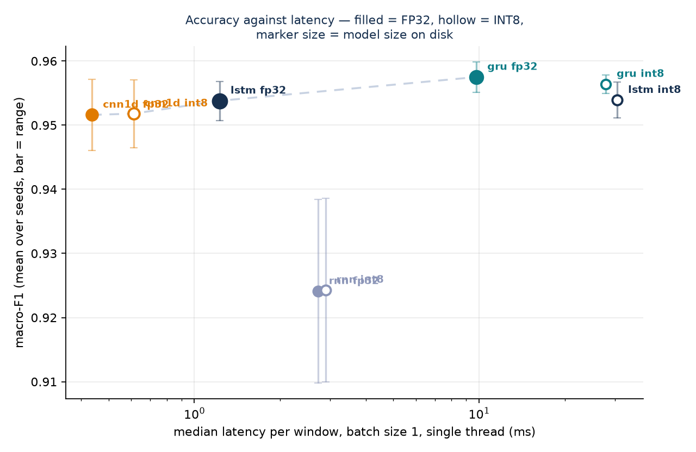
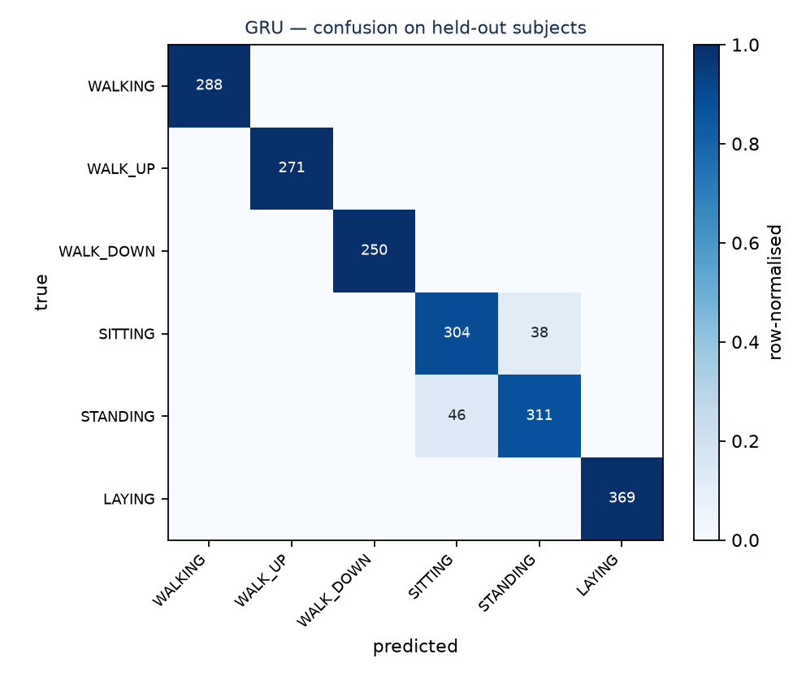

# Human Activity Recognition — architecture choice as a cost decision

Four sequence architectures on the same dataset, the same hyperparameters and the
same measurement harness, compared not only on accuracy but on **what they cost
to run**: parameters, size on disk, and latency for a single window under
deployment conditions. Then INT8 quantisation applied to each, to see what the
compression buys and what it costs.

The question is not "which model is best at HAR". Published results settled that
years ago. The question is the one you actually face when something has to ship:
**does the architecture choice matter more than the noise between training runs,
and what do you give up for the model that runs 40× faster?**

---

## The dataset

[UCI HAR](https://archive.ics.uci.edu/dataset/240/human+activity+recognition+using+smartphones) —
30 subjects wearing a waist-mounted smartphone, performing six activities.
The raw inertial signals are used directly: no hand-engineered features.

| | |
|---|---|
| Input | 9 channels (body acc, gyro, total acc — x/y/z) at 50 Hz |
| Window | 2.56 s = **128 readings**, 50% overlap |
| Tensor | `(N, 128, 9)` |
| Classes | walking, walking upstairs, walking downstairs, sitting, standing, laying |

## The three decisions that make this a study rather than a script

**1 · The split is by subject, not random.**
Windows overlap by 50%, so a random split puts near-duplicate windows on both
sides of it and the model learns to recognise *people* rather than *activities*.
The score looks excellent and the model is useless. Subjects 1–20 train, 21–25
validate, 26–30 test, and the code asserts that no subject appears in two splits.

**2 · Validation decides; the test set is touched once.**
The best epoch is chosen on the validation subjects. The test subjects are
evaluated exactly once, at the end, after reloading the best checkpoint. Choose
the epoch by test score and the test set has quietly become a validation set.

**3 · Latency is measured at batch size 1, single-threaded.**
A wearable classifies one 2.56-second window at a time, on battery. Timing
batches of 64 and dividing answers a *server* question — it amortises per-call
overhead across 64 samples and flatters the number badly. Median and p95 are
reported rather than the mean, because a user-facing classifier is judged by its
bad case.

## The models

All four share `hidden = 64`, `layers = 2`, `dropout = 0.4`, Adam at 1e-3,
gradient clipping at 1.0, early stopping on validation macro-F1 with patience 8.
Matched capacity is the point: if one model wins because it was given more of it,
the study has measured nothing.

| | |
|---|---|
| `RNN` | plain `nn.RNN` — the baseline the gates are supposed to improve on |
| `LSTM` | forget/input/output gates, cell state |
| `GRU` | update/reset gates, no separate cell state |
| `CNN1D` | two `Conv1d` blocks over the **time** axis, then global pooling |

Three seeds each, so a difference between two models can be compared against the
spread within one model.

---

## Results

<!-- RESULTS:START -->
| Model | Precision | Macro-F1 (mean ± range) | Params | Size | p50 ms | p95 ms |
|---|---|---|---|---|---|---|
| CNN1D | fp32 | 0.9516 ± 0.0111 | 24,134 | 101 KB | 0.44 | 0.56 |
| CNN1D | int8 | 0.9518 ± 0.0106 | 24,134 | 101 KB | 0.61 | 0.92 |
| GRU | fp32 | 0.9575 ± 0.0047 | 39,750 | 159 KB | 9.79 | 14.93 |
| GRU | int8 | 0.9564 ± 0.0029 | 39,750 | 46 KB | 27.88 | 43.28 |
| LSTM | fp32 | 0.9538 ± 0.0061 | 52,870 | 211 KB | 1.23 | 1.92 |
| LSTM | int8 | 0.9539 ± 0.0056 | 52,870 | 60 KB | 30.59 | 49.63 |
| RNN | fp32 | 0.9241 ± 0.0286 | 13,510 | 57 KB | 2.72 | 3.71 |
| RNN | int8 | 0.9243 ± 0.0286 | 13,510 | 56 KB | 2.89 | 3.69 |

All timings measured on Intel64 Family 6 Model 142 Stepping 12, GenuineIntel, 8 core(s), **1 thread**, torch 2.14.0+cpu, Python 3.14.3.

### What the numbers say

- **Most accurate (fp32):** GRU at macro-F1 **0.9575** (range 0.0047 across 3 seeds).
- **Fastest (fp32):** CNN1D at **0.44 ms** per window, versus 9.79 ms for GRU — a **22×** difference for a macro-F1 gap of 0.0059.
- **CNN1D and GRU are indistinguishable here:** they differ by 0.0059, inside a seed spread of 0.0111. Any ranking between them is noise.
- **CNN1D and LSTM are indistinguishable here:** they differ by 0.0022, inside a seed spread of 0.0111. Any ranking between them is noise.
- **CNN1D and RNN are indistinguishable here:** they differ by 0.0275, inside a seed spread of 0.0286. Any ranking between them is noise.
- **GRU and LSTM are indistinguishable here:** they differ by 0.0037, inside a seed spread of 0.0061. Any ranking between them is noise.
- **CNN1D under INT8:** 101.0 KB → 100.6 KB (**1.00×**), macro-F1 +0.0002. Only Linear was converted — `Conv1d` is not covered by dynamic quantisation.
- **GRU under INT8:** 159.3 KB → 46.5 KB (**3.43×**), macro-F1 -0.0011.
- **LSTM under INT8:** 210.6 KB → 60.1 KB (**3.50×**), macro-F1 +0.0001.
- **RNN under INT8:** 56.8 KB → 56.4 KB (**1.01×**), macro-F1 +0.0002. Dynamic quantisation converted Linear but **not RNN**, which is why.
- **INT8 costs latency on this CPU, it does not save it.** LSTM goes 1.23 ms → 30.59 ms per window, **24.9× slower**, while shrinking 3.50×. Compression and speed are separate questions and this run separates them.
- **The slowdown tracks the conversion, not the precision flag.** The models that actually shrank (GRU, LSTM) slowed by 2.8–24.9×; the models that dynamic quantisation left alone (CNN1D, RNN) stayed within 1.4×. That is evidence the int8 recurrent kernels are the cause, not measurement drift.
- **Parameter count does not predict CPU latency; the kernel does.** RNN vs LSTM, 13,510 vs 52,870 parameters, 2.72 ms vs 1.23 ms; GRU vs LSTM, 39,750 vs 52,870 parameters, 9.79 ms vs 1.23 ms. Across three seeds every model timed within **1.43×** of itself, so this ordering is a reproducible property of the PyTorch CPU kernels on this machine, not load during the run. Sizing an edge budget from parameter counts would have picked the wrong model.

### Figures



*Filled markers are FP32, hollow are INT8; marker size is the model's size on disk. The dashed line is the Pareto frontier — the points nothing else beats on both axes at once.*



*Held-out subjects. The static postures are where the errors concentrate: SITTING and STANDING differ by orientation, not motion, which is the hardest distinction for an accelerometer to make.*
<!-- RESULTS:END -->

---

## What this measurement does **not** show

Stated plainly, because the framing above invites a stronger claim than the
evidence supports:

- **This is not an on-device measurement.** Latency was measured on an x86 CPU
  under deployment-*shaped* conditions — batch size 1, one thread — not on a
  wearable. ARM numbers do not transfer cleanly from x86.
- **No power measurement.** On a real device battery is often the binding
  constraint, and nothing here speaks to it.
- **No thermal behaviour.** Sustained inference throttles; a short benchmark
  does not see it.
- **One dataset, one window length, one sampling rate.** UCI HAR is clean,
  balanced and collected under supervision. Field data is none of those things.
- **Three seeds is enough to see whether a gap is noise, not enough to put a
  confidence interval on it.**

The exact environment each number was measured in is recorded in
`results/environment.json` — torch version, CPU, thread count. A timing without
its conditions is not a measurement.

---

## Reproducing

```bash
python -m venv .venv && source .venv/bin/activate   # Windows: .venv\Scripts\activate
pip install -r requirements.txt

python run_all.py --selftest        # ~30 s, no dataset — shapes, quantisation, the transpose guard
python run_all.py --models gru --seeds 1    # one run, proves the download and the split
python run_all.py                   # the full study: 4 models × 3 seeds
python make_report.py               # regenerates the Results section above
```

The dataset downloads automatically on first run. If the download fails, fetch
the archive manually and unzip it into `data/` — the loader handles the nested
zip the UCI archive ships.

Expect roughly an hour for the full sweep on a CPU-only machine; the recurrent
models dominate and CNN1D is close to free. `--log-every 5` thins the per-epoch
output; `--epochs 8` gives the full shape of the results in about ten minutes if
you want to check the pipeline end to end first.

## Repository layout

```
run_all.py            the driver: --selftest, or the full sweep
make_report.py        regenerates the Results section from results/summary.csv
src/
  data.py             download, subject-wise split, train-only scaling
  models.py           the four architectures on matched hyperparameters
  train.py            training loop, early stopping, MLflow logging
  measure.py          size, parameters, batch-1 latency, INT8 quantisation
  report.py           aggregation across seeds, tables, Pareto and confusion plots
results/              raw.csv (every run), summary.csv (aggregated), environment.json
figures/              pareto.png, confusion.png
checkpoints/          best weights, per-epoch history, test predictions per run
```

MLflow logging is on by default and writes to `mlruns/`; `--no-mlflow` disables
it. With twelve runs across four models and three seeds, assembling the
comparison by hand is more work than logging it.

## Background

Built on the recurrent-network material from Week 9 and the compression material
from Week 10 of the IIT Kharagpur Executive PG Certificate in Applied AI and
Machine Learning. The three design decisions that make the numbers mean
something — subject-wise splitting, matched hyperparameters, and latency
measured at batch size 1 on a single thread — are stated above with their
reasoning, so this README is self-contained.

## Licence

MIT. See `LICENSE`.
